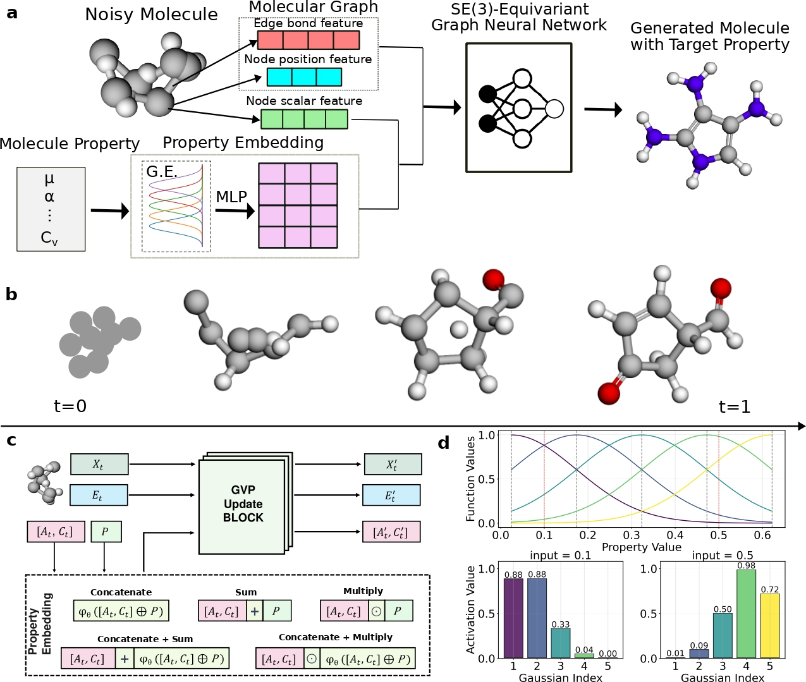

# PropMolFlow: Property-guided Molecule Generation with Geometry-Complete Flow Matching
[](https://arxiv.org/abs/2505.21469)

The paper: [*"PropMolFlow: Property-guided Molecule Generation with Geometry-Complete Flow Matching"*](https://arxiv.org/abs/2505.21469): 
<!-- and Demo on an **[interative website](https://propmolflow-website.vercel.app/)**--> 



## Environment Setup
**Please Make Sure `cuda Version >= 12.8` and you have `conda` installed **


Run the following commands in your terminal to set up `propmolflow` (We have tested the installation on **Nvidia L4 and Blackwell B200** GPUs): 
```bash
conda install mamba # if you do not have mamba
mamba create -n propmolflow python=3.12 nvidia/label/cuda-12.8.1::cuda-toolkit
mamba activate propmolflow
pip install torch==2.7.0 torchvision==0.22.0 torchaudio==2.7.0 --index-url https://download.pytorch.org/whl/cu128
pip install torch-cluster torch_scatter torch_sparse -f https://data.pyg.org/whl/torch-2.7.0%2Bcu128.html
pip install pytorch-lightning==2.5.2
pip install networkx==3.1
pip install einops==0.8.1 rdkit==2025.3.5 py3Dmol==2.5.2 useful-rdkit-utils==0.90
pip install torchtyping ase wandb posebusters 
mamba install -c dglteam/label/th24_cu124 dgl=2.4.0.th24.cu124
pip install -e .
```
Or you can simply install all packages by 
```bash
# make sure clone the repo first, and cd PropMolFlow, so conda can run "pip install -e ." without error
conda env create -f environment.yml
```

**Note:** The original PropMolFlow work was developed using Nvidia A100-SXM4 and 2080Ti graphic cards. However, as we prepared the github repo, University of Florida has completed retired these A100 and 2080Ti graphic cards, and shifted to the L4 and B200 graphic cards.

## Datasets 

### QM9 SDF File
We provide a corrected version of the QM9 SDF file originally from [DeepChem](https://github.com/deepchem/deepchem), fixing issues such as **invalid bond orders** and **non-zero net charges** in approximately **30,000 molecules**.
The SDF data fixing pipeline and its documentation is now included in the folder `propmolflow/sdf_data_fix`.

To download the revised SDF file, run:
```bash
wget https://zenodo.org/records/15700961/files/all_fixed_gdb9.zip
unzip all_fixed_gdb9.zip
rm all_fixed_gdb9.zip
```
After downloading, move the **all_fixed_gdb9.sdf** file to the `data/qm9_raw/` directory:
```bash
mv all_fixed_gdb9.sdf data/qm9_raw/
```

**Note**: The SDF file `all_fixed_gdb9.sdf` (Zenodo version 1), or equivalently `rQM9_v0.sdf` (Zenodo version 2), was used to train models in the PropMolFlow study. It is based on an earlier version of the data-fix pipeline and contains 935 problematic molecules, excluding many molecules that can be fixed in the latest pipeline, which uses the data correction procedure in the paper. In contrast, the latest version of the pipeline reduces this number to 303 problematic molecules and is available on [Zenodo version 2](https://zenodo.org/records/17693354) and HuggingFace [ColabFit rQM9](https://zenodo.org/records/17693354).

### CSV File for Properties
As for csv file contains properties values, it is provided in `data/qm9_raw` directory. 

## Training 
**Note**: Before training the PropMolFlow generative model,  preprocess the `all_fixed_gdb9.sdf` or `rQM_v0.sdf` data first, the yaml configuration file can be arbitrary as long as it contains correct raw data paths and filenames:
```bash
python process_qm9_cond.py --config=configs/with_gaussian_expansion/alpha_concatenate_multiply.yaml
```
We later noticed that this procedure is not perfect as it only removes around 700 molecules that do not pass RDKit sanitization and there are a very small number of remaining problematic molecules (~200 molecules). To get rid of all problematic molecules, you will need the problematic indices, available on the zenodo repo version 2:`https://zenodo.org/records/17693354/files/qm9-sdf-data.zip`.

Then run the **train.py** script. You can either pass a config file, or pass a model checkpoint to continue training.
```python
# training from scratch
python train.py --config=configs/without_gaussian_expansion/alpha_sum.yaml

# continue training from checkpoints
python train.py --resume=checkpoints/in-distribution/alpha/epoch=1845-step=721785.ckpt --config=configs/without_gaussian/alpha_sum.yaml
```
The model checkpoints will be saved in `runs_qm9_valid` folder, you can modify the output dir by changing the **output_dir** argument in the config file.

## Inference

### PropMolFlow Checkpoints
**Note:** We provide **12 model checkpoints** with the **lowest Mean Absolute Error (MAE) values** for **6 molecular properties** by pretrained regressor prediction, covering both **in-distribution** and **out-of-distribution** tasks.

To download and extract them, run:
```bash
wget https://zenodo.org/records/15700961/files/checkpoints.tar
tar -xvf checkpoints.tar
rm checkpoints.tar
```
Details on how properties are incorporated into the model (e.g., whether Gaussian expansion was used)
can be found in the following files:
* data/property_mae_results/in_distribution_best_combo.csv 
* data/property_mae_results/out_of_distribution_best_combo.csv

**Note**: We also provide **all 180 model checkpoints**, representing various combinations of
**property handling methods** and **Gaussian expansion settings**. 

The full benchmark results can be found in:
* data/property_mae_results/in_distribution_full_results.csv
* data/property_mae_results/out_of_distribution_full_results.csv

To download the complete set of checkpoints, run:
```bash
wget https://zenodo.org/records/15700961/files/with_gaussian.tar
tar -xvf with_gaussian.tar
rm with_gaussian.tar

wget https://zenodo.org/records/15700961/files/without_gaussian.tar
tar -xvf without_gaussian.tar
rm without_gaussian.tar
```

### Regressor Checkpoints
**Note:** PropMolFlow does **not** use EGNN from the EDM (Equivariant Diffuison Model) work for molecular property prediction.  
To be self-consistent, we employ **Geometric Vector Perceptrons (GVP)** as the backbone GNN model of PropMolFlow for the property regressor.

The pre-trained GVP model checkpoints are already included in the repository under:  
`propmolflow/property_regressor/model_output` 

There is **no need to download** them separately.

**Note:** To train a GVP regressor by yourself, please run:
```bash
python propmolflow/property_regressor/train_regressor.py --config=propmolflow/property_regressor/configs/regressor_alpha.yaml 
```
The trained model will be saved in path `propmolflow/property_regressor/model_output`.

## Demo
### Sampling (Generate 3D molecules conditioning on properties)

#### In-distribution sampling (sampling from the training data joint distribution of # Atoms and property values, p(n, c))
```bash
# alpha
python sample_condition.py --model_checkpoint "checkpoints/in-distribution/alpha/epoch=1845-step=721785.ckpt" --n_mols 10000 --max_batch_size 128 --n_timesteps 100 --properties_handle_method "sum" --multilple_values_file "sampling_input/in_distribution_sampling/train_half_sampled_values_alpha.npy" --number_of_atoms "sampling_input/in_distribution_sampling/train_half_sampled_no_atoms_alpha.npy" --property_name "alpha" --normalization_file_path "data/qm9/train_data_property_normalization.pt" --output_file "sampling_input/example_sample_result/alpha_in.sdf" --analyze

# cv
python sample_condition.py --model_checkpoint "checkpoints/in-distribution/cv/epoch=1735-step=678541.ckpt" --n_mols 10000 --max_batch_size 128 --n_timesteps 100 --properties_handle_method "sum" --multilple_values_file "in_distribution_sampling/train_half_sampled_values_cv.npy" --number_of_atoms "in_distribution_sampling/train_half_sampled_no_atoms_cv.npy" --property_name "cv" --normalization_file_path "data/qm9/train_data_property_normalization.pt" --output_file "sampling_input/example_sample_result/cv_in.sdf" --analyze

# gap
python sample_condition.py --model_checkpoint "checkpoints/in-distribution/gap/epoch=1867-step=730387.ckpt" --n_mols 10000 --max_batch_size 128 --n_timesteps 100 --properties_handle_method "concatenate_sum" --multilple_values_file "in_distribution_sampling/train_half_sampled_values_gap.npy" --number_of_atoms "in_distribution_sampling/train_half_sampled_no_atoms_gap.npy" --property_name "gap" --normalization_file_path "data/qm9/train_data_property_normalization.pt" --output_file "sampling_input/example_sample_result/gap_in.sdf" --analyze

# homo
python sample_condition.py --model_checkpoint "checkpoints/in-distribution/homo/epoch=1927-step=753691.ckpt" --n_mols 10000 --max_batch_size 128 --n_timesteps 100 --properties_handle_method "concatenate" --multilple_values_file "in_distribution_sampling/train_half_sampled_values_homo.npy" --number_of_atoms "in_distribution_sampling/train_half_sampled_no_atoms_homo.npy" --property_name "homo" --normalization_file_path "data/qm9/train_data_property_normalization.pt" --output_file "sampling_input/example_sample_result/homo_in.sdf" --analyze

# lumo
python sample_condition.py --model_checkpoint "checkpoints/in-distribution/lumo/epoch=1930-step=754942.ckpt" --n_mols 10000 --max_batch_size 128 --n_timesteps 100 --properties_handle_method "concatenate_sum" --multilple_values_file "in_distribution_sampling/train_half_sampled_values_lumo.npy" --number_of_atoms "in_distribution_sampling/train_half_sampled_no_atoms_lumo.npy" --property_name "lumo" --normalization_file_path "data/qm9/train_data_property_normalization.pt" --output_file "sampling_input/example_sample_result/lumo_in.sdf" --analyze

# mu
python sample_condition.py --model_checkpoint "checkpoints/in-distribution/mu/epoch=1868-step=730778.ckpt" --n_mols 10000 --max_batch_size 128 --n_timesteps 100 --properties_handle_method "multiply" --multilple_values_file "in_distribution_sampling/train_half_sampled_values_mu.npy" --number_of_atoms "in_distribution_sampling/train_half_sampled_no_atoms_mu.npy" --property_name "mu" --normalization_file_path "data/qm9/train_data_property_normalization.pt" --output_file "sampling_input/example_sample_result/mu_in.sdf" --analyze
```

#### Out-of-distribution sampling (sampling by a given single value)
```bash
# alpha
python sample_condition.py --model_checkpoint "checkpoints/out-of-distribution/alpha/epoch=1845-step=721785.ckpt" --n_mols 1000 --max_batch_size 128 --n_timesteps 100 --properties_handle_method "sum" --properties_for_sampling 93.3 --number_of_atoms "sampling_input/out_of_distribution_sampling/ood_n_atoms_alpha.npy" --property_name "alpha" --normalization_file_path "data/qm9/train_data_property_normalization.pt" --output_file "sampling_input/example_sample_result/alpha_out.sdf" --analyze

# cv
python sample_condition.py --model_checkpoint "checkpoints/out-of-distribution/cv/epoch=1735-step=678541.ckpt" --n_mols 1000 --max_batch_size 128 --n_timesteps 100 --properties_handle_method "sum" --properties_for_sampling 41.2 --number_of_atoms "sampling_input/out_of_distribution_sampling/ood_n_atoms_cv.npy" --property_name "cv" --normalization_file_path "data/qm9/train_data_property_normalization.pt" --output_file "sampling_input/example_sample_result/cv_out.sdf" --analyze

# gap
python sample_condition.py --model_checkpoint "checkpoints/out-of-distribution/gap/epoch=1637-step=640223.ckpt" --n_mols 1000 --max_batch_size 128 --n_timesteps 100 --properties_handle_method "concatenate" --properties_for_sampling 0.344 --number_of_atoms "sampling_input/out_of_distribution_sampling/ood_n_atoms_gap.npy" --property_name "gap" --normalization_file_path "data/qm9/train_data_property_normalization.pt" --output_file "sampling_input/example_sample_resultult/gap_out.sdf" --analyze

# homo
python sample_condition.py --model_checkpoint "checkpoints/out-of-distribution/homo/epoch=1468-step=574066.ckpt" --n_mols 1000 --max_batch_size 128 --n_timesteps 100 --properties_handle_method "concatenate_sum" --properties_for_sampling=-0.1757 --number_of_atoms "sampling_input/out_of_distribution_sampling/ood_n_atoms_homo.npy" --property_name "homo" --normalization_file_path "data/qm9/train_data_property_normalization.pt" --output_file "sampling_input/example_sample_result/homo_out.sdf" --analyze

# lumo
python sample_condition.py --model_checkpoint "checkpoints/out-of-distribution/lumo/epoch=1865-step=729605.ckpt" --n_mols 1000 --max_batch_size 128 --n_timesteps 100 --properties_handle_method "concatenate_multiply" --properties_for_sampling 0.091 --number_of_atoms "sampling_input/out_of_distribution_sampling/ood_n_atoms_lumo.npy" --property_name "lumo" --normalization_file_path "data/qm9/train_data_property_normalization.pt" --output_file "sampling_input/example_sample_result/lumo_out.sdf" --analyze

# mu
python sample_condition.py --model_checkpoint "checkpoints/out-of-distribution/mu/epoch=1883-step=736409.ckpt" --n_mols 1000 --max_batch_size 128 --n_timesteps 100 --properties_handle_method "sum" --properties_for_sampling 6.74 --number_of_atoms "sampling_input/out_of_distribution_sampling/ood_n_atoms_mu.npy" --property_name "mu" --normalization_file_path "data/qm9/train_data_property_normalization.pt" --output_file "sampling_input/example_sample_result/mu_out.sdf" --analyze
```

#### Sampling Arguments Explanation

- **model_checkpoint**: Path to the trained model checkpoint.
- **n_mols**: Number of molecules to generate.
- **max_batch_size**: Batch size used during sampling. 
- **n_timesteps**: Number of integration steps for the ODE solver.
- **properties_handle_method**: Method for incorporating property values into the model.  
  Choices: `'concatenate'`, `'sum'`, `'multiply'`, `'concatenate_sum'`, `'concatenate_multiply'`.
- **number_of_atoms**: Since property values are often correlated with the number of atoms  
  (e.g., molecules with higher heat capacity often contain more atoms),  
  we will explain how this is handled in the following section.
- **property_name**: Property to condition on.  
  Choices: `'alpha'`, `'cv'`, `'gap'`, `'homo'`, `'lumo'`, `'gap'`.  
  These six properties are selected to allow fair comparison with previous works.
- **multiple_values_file**: Path to a `.npy` file containing multiple property values  
  for sampling in **in-distribution** tasks. The model will generate multiple molecules conditioned on different values.
- **properties_for_sampling**: A single target value to use for **out-of-distribution** sampling.  
  The model will generate multiple molecules conditioned on the same single value.
- **normalization_file_path**: Path to the normalization statistics file. It is used for models without Gaussian expansion.
- **output_file**: Output directory path to save generated molecules.
- **analyze**: Whether to analyze the validity and stability of the generated molecules.


#### In-Distribution task
This section explains how to generate the files required for the **number_of_atoms** and **multiple_values_file** arguments.

To generate these files, run:
```bash
python str2prop_sampler.py
```
If you want to change the number of molecules generated or the output path,
please refer to the configurable arguments inside **str2prop_sampler.py**. 

### Property Evaluation
After sampling, we use pre-trained regressors as detailed in **Regressor Checkpoints** section to predict molecular properties and evaluate the results by comparing the **MAE** between the input target values and the predicted values for raw generated molecules. **Each property has its own pretrained prediction model**.

The prediction results will be saved in the `prediction_result/` directory.

To run **in-distribution** prediction and calculate MAE, use the following command:
```bash
# this is for in-distribution prediction for alpha and calculate MAE values
# when need to evalute other property value, please modify --checkpoint, --input, --output, --properties_values, --property_name 
python propmolflow/property_regressor/test_regressor.py --checkpoint=propmolflow/property_regressor/model_output/alpha/checkpoints/gvp-regressor-epoch=358-val_loss=0.0061.ckpt --config=propmolflow/property_regressor/configs/test.yaml --input=sampling_input/example_sample_result/example_alpha_in.sdf --output=example_case_alpha_in.pt --properties_values=in_distribution_sampling/train_half_sampled_values_alpha.npy --property_name=alpha

# for other properties such as cv, evalution step is following:
python propmolflow/property_regressor/test_regressor.py --checkpoint=propmolflow/property_regressor/model_output/cv/checkpoints/gvp-regressor-epoch=998-val_loss=0.0027.ckpt --config=propmolflow/property_regressor/configs/test.yaml --input=sampling_input/example_sample_result/example_cv_in.sdf --output=example_case_cv_in.pt --properties_values=in_distribution_sampling/train_half_sampled_values_cv.npy --property_name=cv
```
**Note**: For **out-of-distribution** sampling condition on alpha value, a single value is specified `--properties_values` argument:
 ```bash 
# when need to evalute other property value, please modify --checkpoint, --input, --output, --properties_values, --property_name 
python propmolflow/property_regressor/test_regressor.py --checkpoint=propmolflow/property_regressor/model_output/alpha/checkpoints/gvp-regressor-epoch=358-val_loss=0.0061.ckpt --config=propmolflow/property_regressor/configs/test.yaml --input=sampling_input/example_sample_result/example_alpha_out.sdf --output=example_case_out.pt --properties_values=93.3 --property_name=alpha
```
These specific property values for the **out-of-distribution** task  are chosen as the 99th quantile of rQM9 training data. They are provided in `out_of_distribution_sampling/chosen_target_values.json` for different properties. This json file can be generated by running **str2prop_sampler.py**.

## DFT evaluation

To generate the DFT jobs using Gaussian for a generated SDF file, please use the script in `propmolflow/utils/generate_dft_submission.py`

## Use custom datasets
To use your own dataset, please follow the steps in folder `CustomDataset`.

## Citation

If you find this work useful, please cite the following paper:

```bibtex
@article{zeng2025propmolflow,
  title={PropMolFlow: Property-guided Molecule Generation with Geometry-Complete Flow Matching},
  author={Zeng, Cheng and Jin, Jirui and Karypis, George and Transtrum, Mark and Tadmor, Ellad B. and Hennig, Richard G. and Roitberg, Adrian and Martiniani, Stefano and Liu, Mingjie},
  journal={arXiv preprint arXiv:2505.21469},
  year={2025}
}
```


## Acknowledgements
PropMolFlow builds upon the source code from [FlowMol](https://github.com/Dunni3/FlowMol). We sincerely thank the authors of FlowMol for their excellent work.
